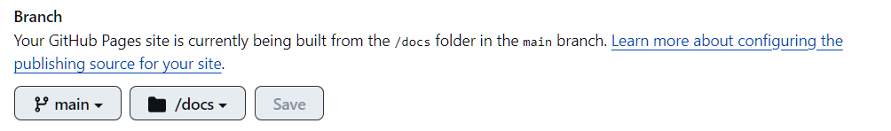

下载docsify

```
npm install docsify-cli -g
```

使用docsify创建目录

```
docsify init ./docs
```

启动

```
docsify serve docs
```

在3000端口打开进行预览

更改index.html

```html
<div id="app"></div>
<script>
window.$docsify = {
    name: '文档示例', // 文档的名称
    repo: 'https://github.com/lagrahhn/wx_code' // 指向的GitHub仓库链接
    coverpage: true, // 显示封面
    loadSidebar: true, // 显示侧边栏
    maxLevel: 5,//最大支持渲染的标题层级
    subMaxLevel: 3, // 显示标题的层级
    homepage: 'README.md', // 封面的内容，需要开启coverpage
}
</script>
```

将当前文件夹提交到GitHub仓库中，然后点击仓库的Settings，找到左边的Pages，
找到下面的，选择自己的分支，选择为docs目录，点击save保存，然后到https://<GitHub名称>.github.io/<仓库名称>即可，以后，在本地修改完内容后，直接提交到GitHub仓库中即可。


